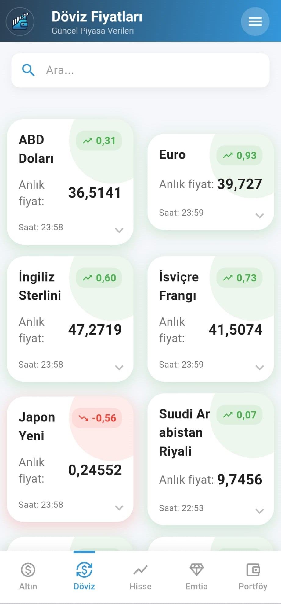
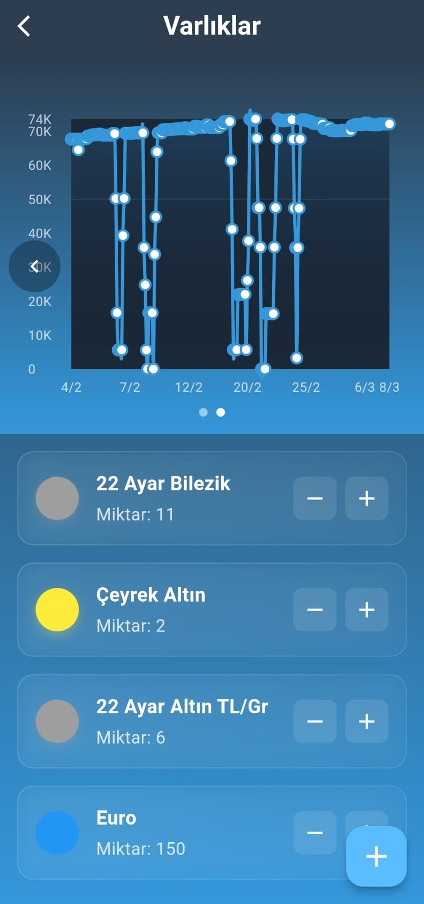
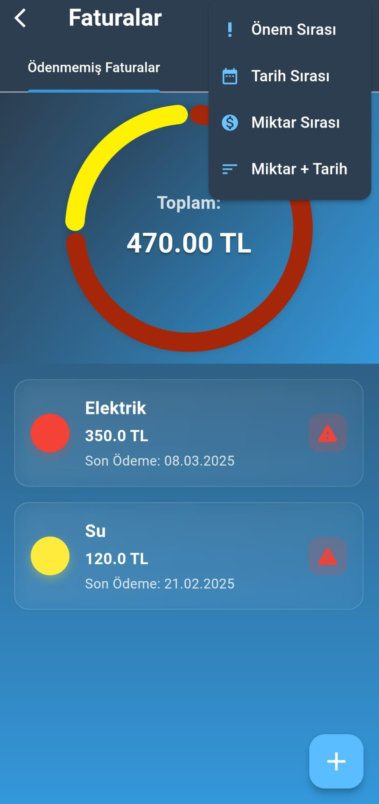

# 💼 Cüzdan - Wealth Calculator

**English** | [Türkçe](README_TR.md)


A comprehensive financial management solution for Turkish markets with real-time asset tracking and wealth analysis.

<table>
  <!-- Asset Price Tracking Row -->
  <tr>
    <td width="30%">
      <h3>1. Asset Price Tracking</h3>
      <ul>
        <li>Real-time gold, currency (USD/EUR/TRY), commodity and BIST100 monitoring</li>
        <li>Firebase database for reliable data management</li>
        <li>Historical price charts</li>
      </ul>
    </td>
    <td>
      <div style="display: flex; gap: 10px; overflow-x: auto;">
        
        
        
        
      </div>
    </td>
  </tr>

  <!-- Inventory Management Row -->
  <tr>
    <td>
      <h3>2. Inventory Management</h3>
      <ul>
        <li>Multi-asset portfolio tracking</li>
        <li>Custom category creation</li>
        <li>Barcode scanning for physical assets</li>
        <li>Net worth calculation in TRY</li>
      </ul>
    </td>
    <td>
      <div style="display: flex; gap: 10px;">
        
        
      </div>
    </td>
  </tr>

  <!-- Invoice Management Row -->
  <tr>
    <td>
      <h3>3. Invoice Management</h3>
      <ul>
        <li>Digital invoice storage with OCR</li>
        <li>Payment deadline notifications</li>
        <li>Vendor management system</li>
        <li>Monthly expenditure reports</li>
      </ul>
    </td>
    <td>
      <div style="display: flex; gap: 10px; overflow-x: auto;">
        
        
        
      </div>
    </td>
  </tr>

  <!-- Wealth Calculator Row -->
  <tr>
    <td>
      <h3>4. Portfolio Tracker</h3>
      <ul>
        <li>Quick asset addition and calculation</li>
        <li>Multiple asset type support (gold, currency, bist100, commodity)</li>
      </ul>
    </td>
    <td>
      <div style="display: flex; gap: 10px;">
        
      </div>
    </td>
  </tr>
</table>

## 🏗️ Architecture

This project follows a **Feature-First Clean Architecture** pattern, providing clear separation of concerns and maintainability.

### 📁 Project Structure

```
lib/
├── 🎯 feature/          # Feature Modules (Self-contained vertical slices)
│   ├── prices/         # Asset price tracking
│   ├── inventory/      # Portfolio management
│   ├── invoice/        # Invoice tracking
│   ├── calculator/     # Wealth calculator
│   ├── profile/        # Profile management
│   ├── settings/       # App configuration
│   └── splash/         # Initial loading
│
├── 🎨 product/          # Shared Product Layer
│   ├── init/           # App initialization
│   ├── navigation/     # Routing (AppRouter)
│   ├── state/          # Global state management
│   ├── service/        # DAOs & data services
│   ├── utility/        # Constants & helpers
│   └── widget/         # Reusable UI components
│
└── 🎬 main.dart         # Application entry point
```

### 🔄 Architecture Principles

- **Feature Independence**: Each feature is self-contained with its own view/viewmodel/model
- **BLoC Pattern**: State management using flutter_bloc for predictable state handling
- **Clean Architecture Layers**:
  - **Presentation**: Views and UI components
  - **Application**: BLoCs/Cubits (business logic)
  - **Domain**: Models and business entities
  - **Data**: Services, DAOs, and external data sources
- **Dependency Flow**: Features → Product Layer → External Dependencies

### 🗄️ Data Layer
- **SQLite Database**: Local persistent storage
- **Custom DAOs**: Specialized data access objects for each domain
- **Firebase Database**: Real-time market data synchronization
- **Strategy Pattern**: Flexible data source management with strategy pattern implementation
- **Notification Service**: Background task scheduling

📚 For detailed architecture documentation, see [ARCHITECTURE_VISUAL.md](wealth_calculator/ARCHITECTURE_VISUAL.md)

### Key Components
- Custom widgets for wealth display and management
- Notification system for invoice alerts
- Database helpers for local data management
- Utility functions for calculations and conversions

## 📊 Data Management
- 🔒 Secure local storage using SQLite
- 📡 Firebase Realtime Database integration
- 🎯 Flexible data source management with strategy pattern
- 📦 Custom DAO (Data Access Object) implementations for:
  - Inventory management
  - Invoice tracking
  - Price monitoring
  - Portfolio list handling

## 🎨 Features

### 💰 Multi-Asset Support
- Gold (gram, quarter, half, full)
- Currencies (USD, EUR, GBP, CHF)
- Real estate valuation

### 📈 Real-Time Data
- Live price updates
- Real-time synchronization with Firebase database
- Historical price charts
- Portfolio performance analysis

### 🔔 Smart Notifications
- Invoice payment reminders
- Price alert systems
- Customizable notification settings

### 🌐 Multi-Language Support
- Turkish
- English
- Easy translation management with easy_localization

## 📥 Installation

Clone the repository and ensure you have Flutter installed on your system. Run the following commands:

```bash
# Install dependencies
flutter pub get

# Run the application
flutter run
```

## 📦 Dependencies

### Core Packages
- **flutter_bloc** (^8.1.0): State management
- **sqflite** (^2.3.3+1): Local database
- **http** (^1.6.0) & **html** (^0.15.0): Web scraping
- **easy_localization** (^3.0.7): Multi-language support
- **fl_chart** (^0.70.0): Chart visualization
- **flutter_local_notifications** (^17.2.2): Notification management

### Dependency Injection
- **get_it** (^9.2.0): Service location
- **vexana** (^5.0.3): Network management

### UI/UX
- **lottie** (^3.0.0): Animations
- **flutter_native_splash** (^2.4.0): Splash screen
- **intl** (^0.20.2): Date and number formatting

## 🛠️ Development

### Project Structure
```
wealth_calculator/
├── lib/
│   ├── feature/        # Feature modules
│   ├── product/        # Shared layer
│   └── main.dart
├── assets/
│   └── translations/   # Language files
├── database/           # SQLite database files
└── screenshots/        # App screenshots
```

### Testing
```bash
flutter test
```

### Build
```bash
# Android APK
flutter build apk --release

# iOS IPA
flutter build ios --release
```

## 📱 Platform Support
- ✅ Android
- ✅ iOS

## 📄 License
This project is licensed under the MIT License.

## 🤝 Contributing
Contributions are welcome! Please open an issue or submit a pull request.

## 📧 Contact
For questions or suggestions, please open an issue.
