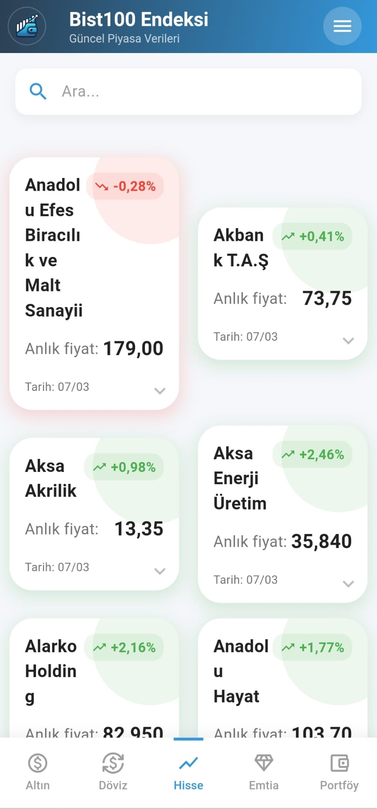
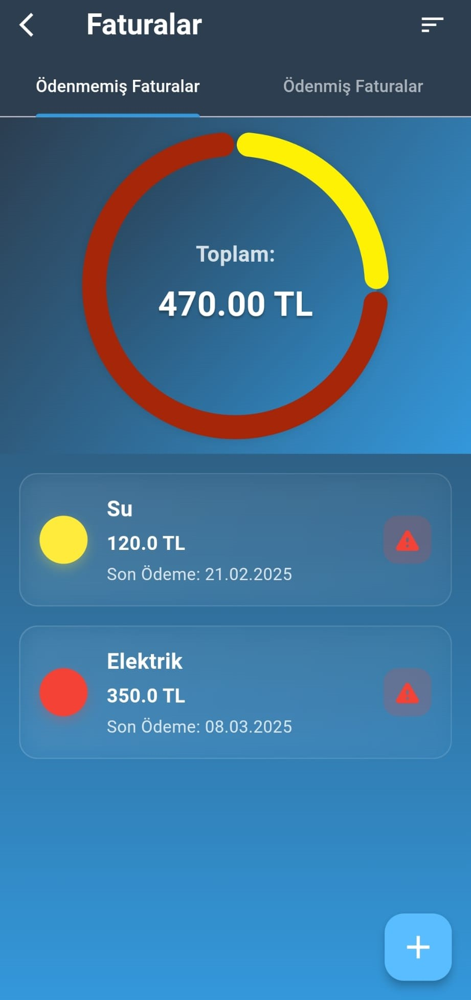

# 💼 Cüzdan - Wealth Calculator


A comprehensive financial management solution for Turkish markets with real-time asset tracking and wealth analysis.

<table>
  <!-- Asset Price Tracking Row -->
  <tr>
    <td width="30%">
      <h3>1. Asset Price Tracking</h3>
      <ul>
        <li>Real-time gold, currency (USD/EUR/TRY), commodity and BIST100 monitoring</li>
        <li>Automated data scraping from Turkish financial sources</li>
        <li>Historical price charts</li>
      </ul>
    </td>
    <td>
      <div style="display: flex; gap: 10px; overflow-x: auto;">
        
        
        
        
      </div>
    </td>
  </tr>

  <!-- Inventory Management Row -->
  <tr>
    <td>
      <h3>2. Inventory Management</h3>
      <ul>
        <li>Multi-asset portfolio tracking</li>
        <li>Custom category creation</li>
        <li>Barcode scanning for physical assets</li>
        <li>Net worth calculation in TRY</li>
      </ul>
    </td>
    <td>
      <div style="display: flex; gap: 10px;">
        
        
      </div>
    </td>
  </tr>

  <!-- Invoice Management Row -->
  <tr>
    <td>
      <h3>3. Invoice Management</h3>
      <ul>
        <li>Digital invoice storage with OCR</li>
        <li>Payment deadline notifications</li>
        <li>Vendor management system</li>
        <li>Monthly expenditure reports</li>
      </ul>
    </td>
    <td>
      <div style="display: flex; gap: 10px; overflow-x: auto;">
        
        
        
      </div>
    </td>
  </tr>
</table>

## 🏗️ Architecture

This project follows a **Feature-First Clean Architecture** pattern, providing clear separation of concerns and maintainability.

### 📁 Project Structure

```
lib/
├── 🎯 feature/          # Feature Modules (Self-contained vertical slices)
│   ├── prices/         # Asset price tracking
│   ├── inventory/      # Portfolio management
│   ├── invoice/        # Invoice tracking
│   ├── settings/       # App configuration
│   └── splash/         # Initial loading
│
├── 🎨 product/          # Shared Product Layer
│   ├── init/           # App initialization
│   ├── navigation/     # Routing (AppRouter)
│   ├── state/          # Global state management
│   ├── service/        # DAOs & data services
│   ├── utility/        # Constants & helpers
│   └── widget/         # Reusable UI components
│
└── 🎬 main.dart         # Application entry point
```

### 🔄 Architecture Principles

- **Feature Independence**: Each feature is self-contained with its own view/viewmodel/model
- **BLoC Pattern**: State management using flutter_bloc for predictable state handling
- **Clean Architecture Layers**:
  - **Presentation**: Views and UI components
  - **Application**: BLoCs/Cubits (business logic)
  - **Domain**: Models and business entities
  - **Data**: Services, DAOs, and external data sources
- **Dependency Flow**: Features → Product Layer → External Dependencies

### 🗄️ Data Layer
- **SQLite Database**: Local persistent storage
- **Custom DAOs**: Specialized data access objects for each domain
- **Web Scraping**: Real-time market data fetching
- **Notification Service**: Background task scheduling

📚 For detailed architecture documentation, see [ARCHITECTURE_VISUAL.md](ARCHITECTURE_VISUAL.md)

### Key Components
- Custom widgets for wealth display and management
- Notification system for invoice alerts
- Database helpers for local data management
- Utility functions for calculations and conversions

## Data Management
- 🔒 Secure local storage using SQLite
- 📡 Efficient data scraping services
- 📦 Custom DAO (Data Access Object) implementations for:
  - Inventory management
  - Invoice tracking
  - Price monitoring
  - Portfolio list handling

## 📥 Installation

Clone the repository and ensure you have Flutter installed on your system. Run the following commands:

```bash
flutter pub get
flutter run
```

## 📦 Dependencies
- Flutter SDK
- SQLite for local database
- BLoC pattern libraries
- HTTP client for data scraping
