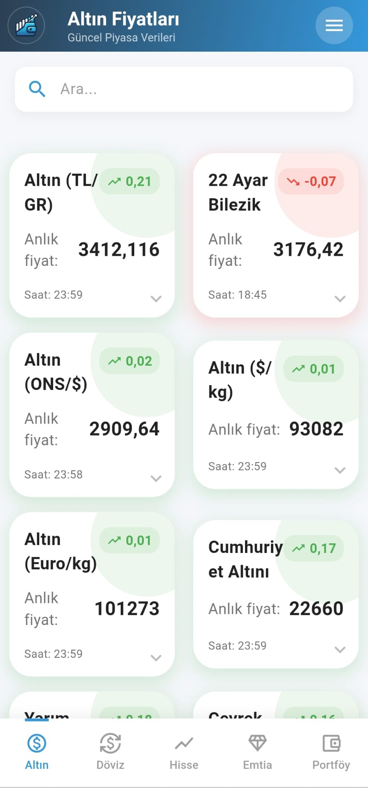
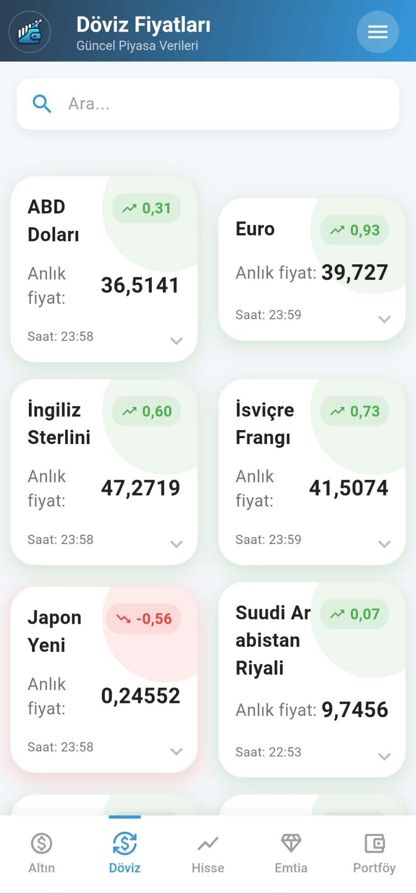
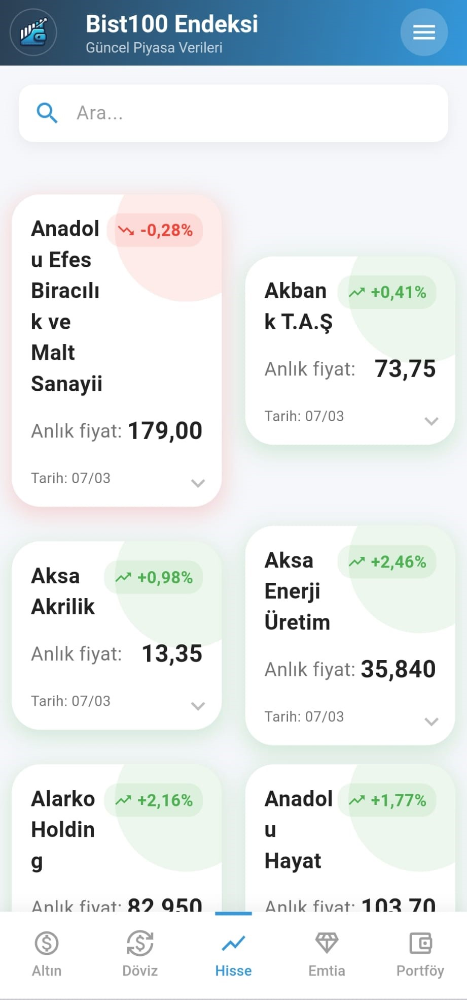
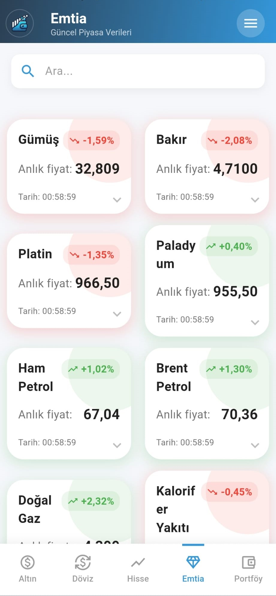
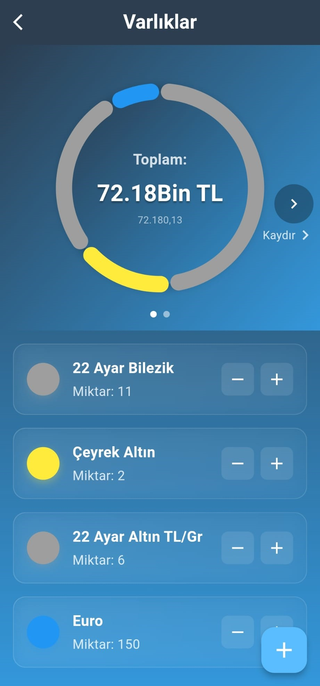
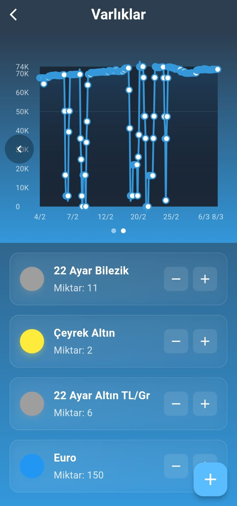
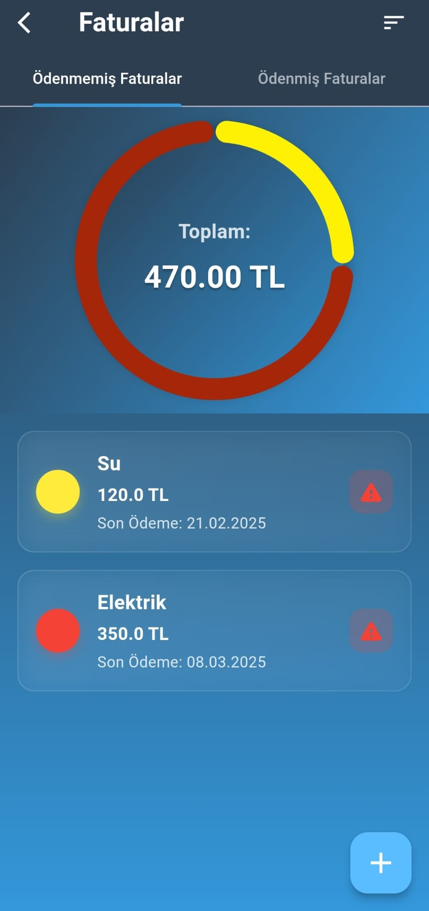
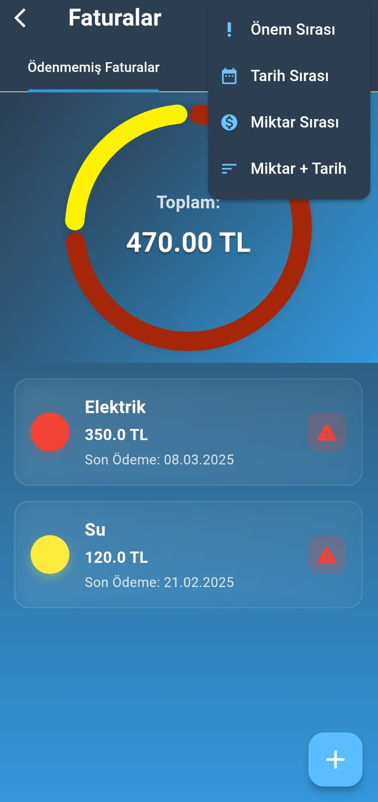
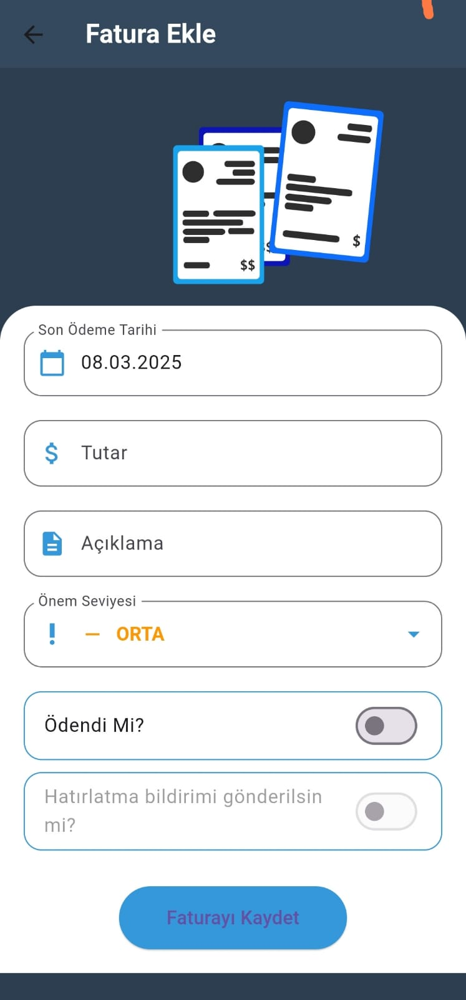
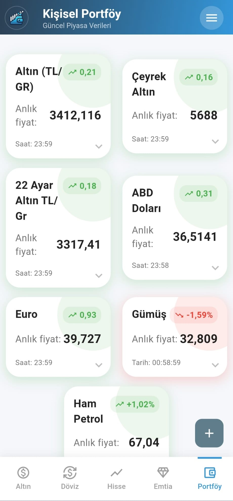

# 💼 Cüzdan - Servet Hesaplayıcı

[English](README.md) | **Türkçe**


Türkiye pazarları için gerçek zamanlı varlık takibi ve servet analizi sunan kapsamlı bir finansal yönetim çözümü.

<table>
  <!-- Varlık Fiyat Takibi Satırı -->
  <tr>
    <td width="30%">
      <h3>1. Varlık Fiyat Takibi</h3>
      <ul>
        <li>Neredeyse gerçek zamanlı altın, döviz (USD/EUR/TRY), emtia ve BIST100 takibi</li>
        <li>Firebase veritabanı ile güvenilir veri yönetimi</li>
        <li>Geçmiş fiyat grafikleri</li>
      </ul>
    </td>
    <td>
      <div style="display: flex; gap: 10px; overflow-x: auto;">
        
        
        
        
      </div>
    </td>
  </tr>

  <!-- Envanter Yönetimi Satırı -->
  <tr>
    <td>
      <h3>2. Envanter Yönetimi</h3>
      <ul>
        <li>Çoklu varlık portföy takibi</li>
        <li>Özel kategori oluşturma</li>
        <li>TRY cinsinden net servet hesaplama</li>
      </ul>
    </td>
    <td>
      <div style="display: flex; gap: 10px;">
        
        
      </div>
    </td>
  </tr>

  <!-- Fatura Yönetimi Satırı -->
  <tr>
    <td>
      <h3>3. Fatura Yönetimi</h3>
      <ul>
        <li>Ödeme son tarihi bildirimleri</li>
        <li>Aylık harcama raporları</li>
      </ul>
    </td>
    <td>
      <div style="display: flex; gap: 10px; overflow-x: auto;">
        
        
        
      </div>
    </td>
  </tr>

  <!-- Servet Hesaplayıcı Satırı -->
  <tr>
    <td>
      <h3>4. Portföy Takibi</h3>
      <ul>
        <li>Hızlı varlık ekleme</li>
        <li>Çoklu varlık türü desteği (altın, döviz, bist100, emtia)</li>
      </ul>
    </td>
    <td>
      <div style="display: flex; gap: 10px;">
        
      </div>
    </td>
  </tr>
</table>

## 🏗️ Mimari

Bu proje, net sorumluluk ayrımı ve sürdürülebilirlik sağlayan **Feature-First Clean Architecture** (Özellik-Öncelikli Temiz Mimari) desenini takip eder.

### 📁 Proje Yapısı

```
lib/
├── 🎯 feature/          # Özellik Modülleri (Kendi başına yeten dikey kesitler)
│   ├── prices/         # Varlık fiyat takibi
│   ├── inventory/      # Portföy yönetimi
│   ├── invoice/        # Fatura takibi
│   ├── calculator/     # Servet hesaplayıcı
│   ├── profile/        # Profil yönetimi
│   ├── settings/       # Uygulama yapılandırması
│   └── splash/         # İlk yükleme
│
├── 🎨 product/          # Paylaşılan Ürün Katmanı
│   ├── init/           # Uygulama başlatma
│   ├── navigation/     # Yönlendirme (AppRouter)
│   ├── state/          # Global durum yönetimi
│   ├── service/        # DAO'lar ve veri servisleri
│   ├── utility/        # Sabitler ve yardımcılar
│   └── widget/         # Yeniden kullanılabilir UI bileşenleri
│
└── 🎬 main.dart         # Uygulama giriş noktası
```

### 🔄 Mimari Prensipleri

- **Özellik Bağımsızlığı**: Her özellik kendi view/viewmodel/model ile kendi başına yeten bir yapıdır
- **BLoC Deseni**: Öngörülebilir durum yönetimi için flutter_bloc kullanımı
- **Temiz Mimari Katmanları**:
  - **Sunum**: View'lar ve UI bileşenleri
  - **Uygulama**: BLoC'lar/Cubit'ler (iş mantığı)
  - **Domain**: Modeller ve iş varlıkları
  - **Veri**: Servisler, DAO'lar ve harici veri kaynakları
- **Bağımlılık Akışı**: Özellikler → Ürün Katmanı → Harici Bağımlılıklar

### 🗄️ Veri Katmanı
- **SQLite Veritabanı**: Yerel kalıcı depolama
- **Özel DAO'lar**: Her domain için özelleştirilmiş veri erişim nesneleri
- **Firebase Veritabanı**: Gerçek zamanlı piyasa verisi senkronizasyonu
- **Strateji Deseni**: Esnek veri kaynağı yönetimi için strategy pattern implementasyonu
- **Bildirim Servisi**: Arka plan görev zamanlama

📚 Detaylı mimari dokümantasyonu için, [ARCHITECTURE_VISUAL.md](wealth_calculator/ARCHITECTURE_VISUAL.md) dosyasına bakınız

### Ana Bileşenler
- Servet görüntüleme ve yönetim için özel widget'lar
- Fatura uyarıları için bildirim sistemi
- Yerel veri yönetimi için veritabanı yardımcıları
- Hesaplama ve dönüşümler için yardımcı fonksiyonlar

## 📊 Veri Yönetimi
- 🔒 SQLite kullanarak güvenli yerel depolama
- 📡 Firebase Realtime Database entegrasyonu
- 🎯 Strateji deseni ile esnek veri kaynağı yönetimi
- 📦 Özel DAO (Data Access Object) implementasyonları:
  - Envanter yönetimi
  - Fatura takibi
  - Fiyat izleme
  - Portföy listesi yönetimi

## 🎨 Özellikler

### 💰 Çoklu Varlık Desteği
- Altın (gram, çeyrek, yarım, tam)
- Döviz (USD, EUR, GBP, CHF)
- BIST100 hisseleri
- Emtialar
- Gayrimenkul değerleme

### 📈 Gerçek Zamanlı Veri
- Firebase veritabanı ile gerçek zamanlı senkronizasyon
- Tarihsel fiyat grafikleri
- Portföy performans analizi

### 🔔 Akıllı Bildirimler
- Fatura ödeme hatırlatmaları
- Özelleştirilebilir bildirim ayarları

### 🌐 Çoklu Dil Desteği
- Türkçe
- İngilizce
- easy_localization ile kolay çeviri yönetimi

## 📥 Kurulum

Depoyu klonlayın ve sisteminizde Flutter'ın kurulu olduğundan emin olun. Ardından aşağıdaki komutları çalıştırın:

```bash
# Bağımlılıkları yükle
flutter pub get

# Uygulamayı çalıştır
flutter run
```

## 📦 Bağımlılıklar

### Ana Paketler
- **flutter_bloc** (^8.1.0): Durum yönetimi
- **sqflite** (^2.3.3+1): Yerel veritabanı
- **http** (^1.6.0) & **html** (^0.15.0): Web scraping
- **easy_localization** (^3.0.7): Çoklu dil desteği
- **fl_chart** (^0.70.0): Grafik görselleştirme
- **flutter_local_notifications** (^17.2.2): Bildirim yönetimi

### Dependency Injection
- **get_it** (^9.2.0): Servis lokasyonu
- **vexana** (^5.0.3): Network yönetimi

### UI/UX
- **lottie** (^3.0.0): Animasyonlar
- **flutter_native_splash** (^2.4.0): Splash ekranı
- **intl** (^0.20.2): Tarih ve sayı formatlama

## 🛠️ Geliştirme

### Proje Yapısı
```
wealth_calculator/
├── lib/
│   ├── feature/        # Özellik modülleri
│   ├── product/        # Paylaşılan katman
│   └── main.dart
├── assets/
│   └── translations/   # Dil dosyaları
├── database/           # SQLite veritabanı dosyaları
└── screenshots/        # Uygulama ekran görüntüleri
```

### Test
```bash
flutter test
```

### Build
```bash
# Android APK
flutter build apk --release

# iOS IPA
flutter build ios --release
```

## 📱 Platform Desteği
- ✅ Android
- ✅ iOS

## 📄 Lisans
Bu proje MIT lisansı altında lisanslanmıştır.

## 🤝 Katkıda Bulunma
Katkılar memnuniyetle karşılanır! Lütfen bir issue açın veya pull request gönderin.

## 📧 İletişim
Sorularınız veya önerileriniz için lütfen bir issue açın.
